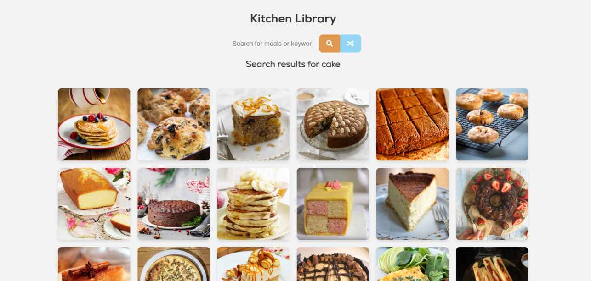

# Kitchen Library - Random Meal Generator



This is a web application that allows you to search for meals using themeadb.com API and also generates random meals. You can view the details of each meal by clicking on it.

## Live Demo
To see this website live, visit: [Kitchen Library](https://raazvardhan.github.io/Kitchen-Library/)

## Project Specifications
- Display UI with a search form and a button to generate random meals.
- Connect to themeadb.com API to fetch meals based on the search query or generate a random meal.
- Display the meals in the DOM with images and a hover effect.
- Click on a meal to view its details.

## Getting Started
To run the project locally, follow these steps:

1. Clone the repository:
   ```
   git clone https://github.com/raazvardhan/Kitchen-Library.git
   ```

2. Navigate to the project directory:
   ```
   cd Kitchen-Library
   ```

3. Open the `index.html` file in your web browser.

## Dependencies
This project uses the following technologies and libraries:

- HTML, CSS, and JavaScript for the frontend.
- themeadb.com API to fetch meal data.
